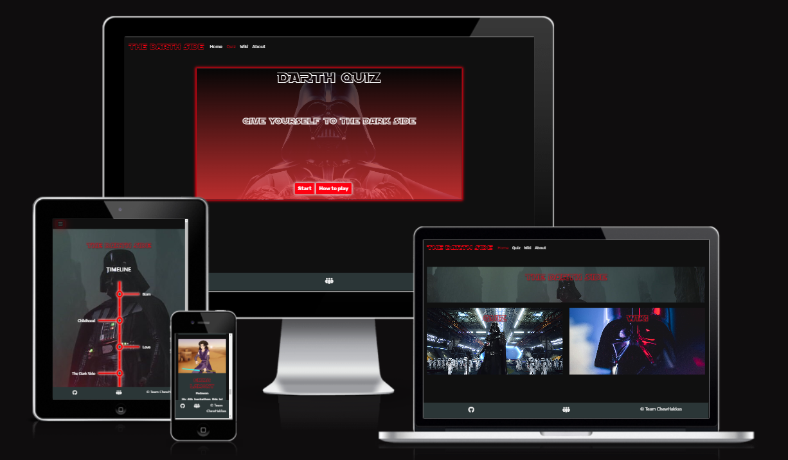
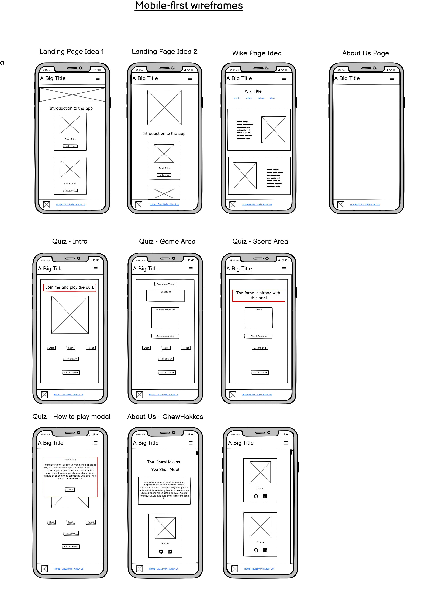
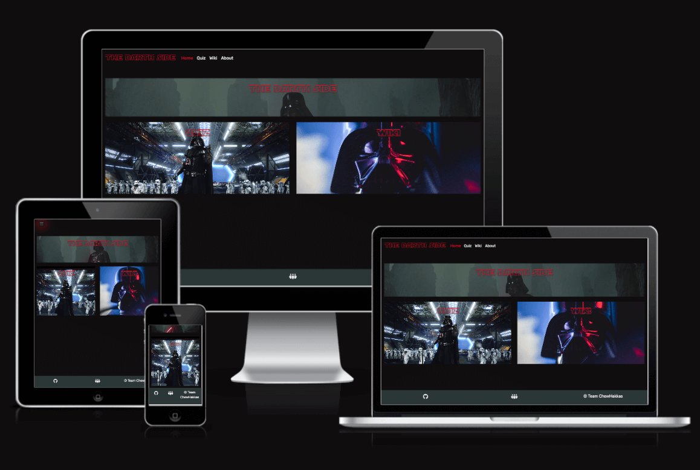
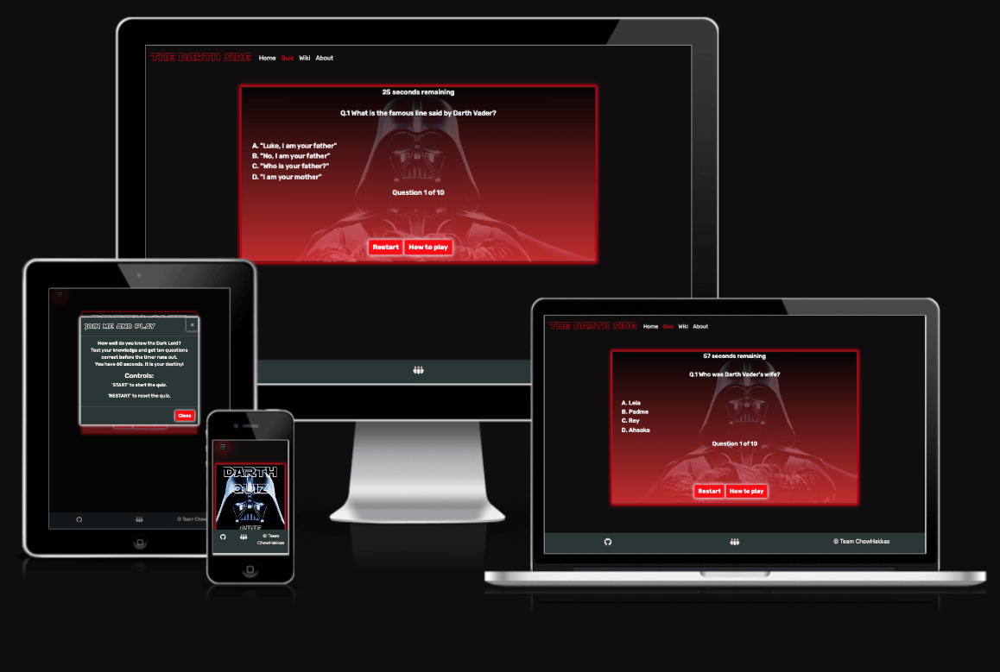
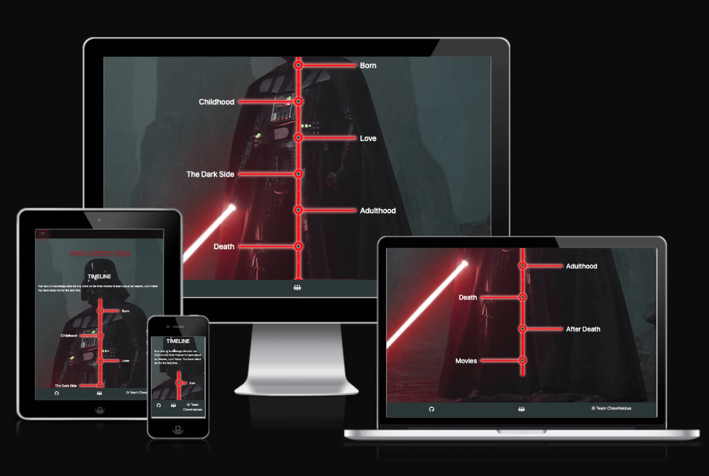
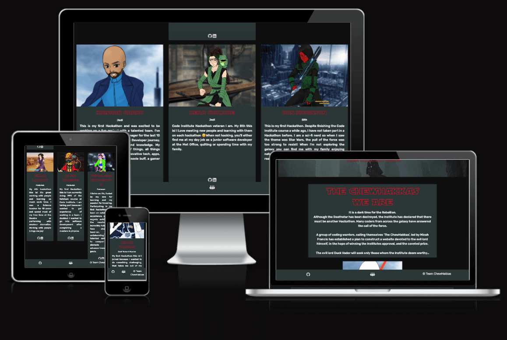
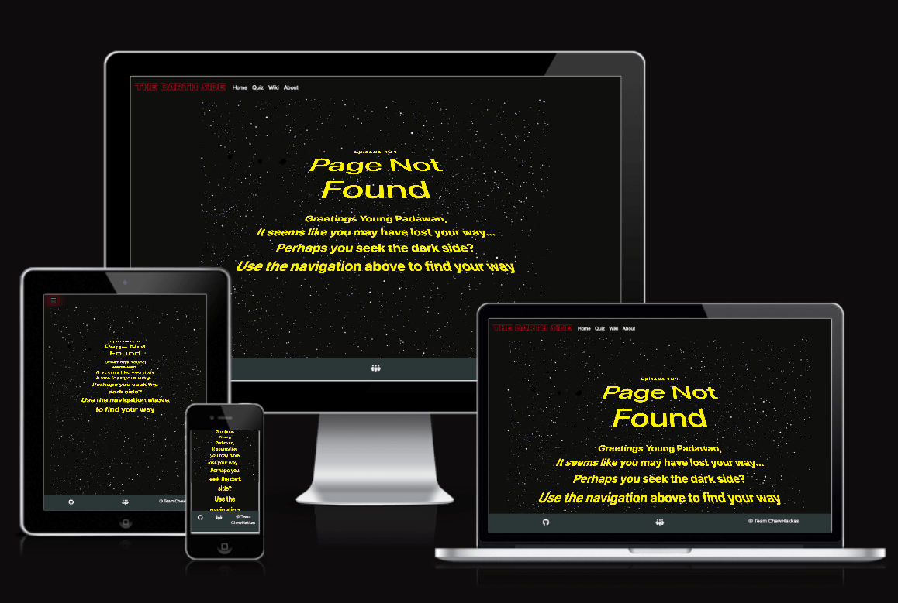

# Code Wars - May Hackathon 2024

Visit the deployed site: [The Darth Side](https://desislavanaydenova.github.io/2405-hackathon-team1-StarWars/quiz.html)

## Introduction

### Problem Statement

The Darth Side is a website designed to provide fans with the opportunity to learn about and test their knowledge on the iconic Darth Vader from the legendary Star Wars franchise.

## User Stories

### Navigation

- I want to gain access to the gain access to the Home, About Us, Quiz and Wiki page via the nav bar so that I can understand what areas of the site to visit.
- I want to able to visually identify what page I am on using the nav bar so that I can know what page I am on.

### Home Page

- I want to be able to view a home page with an image of Darth Vader so that I can understand the theme of the website.
- I want to have clear options on what areas of the site I should visit so that I understand where the main features of the site are.

### About Us

- I want to view a list of collaborators and their roles so that I can understand who was involved in building the site.

### Quiz Page

- I want to be able to participate in a quiz about Darth Vader so that I can test my knowledge about this character.
- I want to have multiple choice options so that I have I higher chance of selecting the correct answer.
- I want to receive a performance based nofication upon completion so that I can see how well I know Darth Vader.
- I want to be able to refer to the instructions without having to restart the game so that I can have a quick reminder if I forget and continue to play.
- I want to have Start and Restart buttons so I have some control over the flow of the game.
- I want to have time limited questions so that the game doesn't take all day.

### Wiki Page

- I want to be able to view a timeline of Darth Vaders life story so that I can learn about the character in a structured way.
- I want to be able to read text that is relevant to each part of the timeline so that I can learn about specific area that interest me.
- I want to be able to view a relevant image on each part of the timeline so that I can gain a visual understanding of what happend during this period.

### General

- I want to be able to hear the lightsaber sound when I hover over key areas of the site so that I can feel like I am part of the Star Wars verse.

## Criteria

- **Project is Star Wars themed**
- The website is centred around the antagonist of the original Star Wars trilogy: Darth Vader.

- **Well-executed project with effective planning using GitHub Projects and a basic README.md**
- Agile methodology was used by appointing a Scrum Master (Micah) and utilising a Kanban board on GitHub in order to prioritise and organise tasks.

- **The project uses Star Wars sound effects**
- When hovering over 'Team ChewHakkas' on the homepage, Chewbaccas signature growl is heard.
- Lightsaber sounds are heard when hovering over boxes on the homepage.
- Darth Vader's voice is heard at the end of the quiz.

- **Project demonstrates responsiveness, accessibility, and thorough testing**
- Project was designed with a mobile first approach. BootStrap was utilised to ensure responsiveness across all screen sizes.
- The site was continually manually tested by members throughout development.
- Please read the [TESTING.md](TESTING.md) document for further evidence of testing.

- **Fun and entertaining presentation**
- A video presentation was created using OBS.
- The presentation was presented as a 'recruitment to the Empire' presentation in order to add entertainment value.

## Design

- 
- We focused our design around the character of Darth Vader. He wears a dark hooded cloak and carries a red lightsaber. The Star Wars universe also uses a distinctive font which we utilised on our site. Hover effects were used to create a light blurred effect around the edges of buttons on the site - to emulate a lightsaber.

### Wireframes

- 

### Colour scheme

- 
- The colour scheme was chosen to match the costume of Darth Vader but also to provide enough contrast for accessibility reasons.

### Font

We chose to use [Rubik](https://fonts.google.com/specimen/Rubik?preview.text=What%20colour%20is%20Darth%20Vader%27s%20light%20saber%3F&query=news) for the main text and [SF Distant Galaxy Font](https://www.fontspace.com/sf-distant-galaxy-font-f6436) by ShyFoundry (which we renamed to 'starwars' for ease of use) for headings.

## Accessibility

- The colour scheme was run through a [Web Accessibility Colour Contrast Checker](https://accessibleweb.com/color-contrast-checker/) to ensure good contrast for colours.
- Aria labels were added so that users with screen readers can access the site more easily.

## Responsiveness

- Bootstrap has been utilised through the site which provides great responsiveness on a range of devices. We have also used custom media queries where required (for example on the 404 page).

## Features

### Home Page 

### Quiz

- The Quiz uses 10 questions from a bank of 16 randomised questions which are shuffled to give the quiz repeatability.
- There is a 60 second timer to complete the whole quiz.
- There is an option to restart the quiz throughout by use of a 'Restart' button.
- At the end of the quiz, you can review your answers before you restart the quiz.
- A different message/voiceover is shown dependent on your score on the quiz. 

### Wiki Page

- Information is displayed in the form of a timeline.
- When each time-frame is clicked on, a box appears containing the relevant information for that time frame. The box disappears again when clicked.

### About Page

### 404 Page

## Tech used

- HTML
- CSS
- JavaScript
- [Bootstrap (Version 4.6)](https://getbootstrap.com/docs/4.6/getting-started/introduction/) CSS framework
- TinyPNG - For compressing images
- Birme - To convert images to WEBP format

## Credits

- [404 Page text crawl](https://itsilesia.com/star-wars-opening-crawl-based-on-css-animations-and-transformations/)
- [Darth Vader information](https://en.wikipedia.org/wiki/Darth_Vader)

## Media

### Images:

Most of the images used are from [StarWars.com](https://www.starwars.com/).

- [Darth Vader (hero image)](https://www.starwars.com/databank/darth-vader)
- [Darth with stormtroopers](https://www.starwars.com/databank/darth-vader?image_id=5390fdbc0a172d315d00030e)
- [Darth and Luke Skywalker](https://www.starwars.com/databank/darth-vader?image_id=5390fdbc0a172d315d000316)
- [Darth without helmet](https://www.starwars.com/databank/anakin-skywalker?image_id=5390fdbc0a172d315d0003b9)
- [Anakin and Padme](https://www.starwars.com/databank/anakin-skywalker?image_id=5390fdbc0a172d315d0003a9)
- [Anakin and Palpatine](https://www.starwars.com/databank/anakin-skywalker?image_id=5390fdbc0a172d315d0003b4)
- [Shmi (Anakins mother)](https://www.starwars.com/databank/shmi-skywalker-lars)
- [Anakin meal time](https://www.starwars.com/databank/shmi-skywalker-lars?image_id=55fb4f8ad66c4d274a02c118undefined)
- [Star Wars movies](https://www.starwars.com/films) image a composite of images taken from StarWars.com
- [Darth in front of Storm Troopers](https://www.hdwallpapers.in/darth_vader_stormtroopers-wallpapers.html) quiz image of the Darth Vader on the home page.
- [Anakin](https://www.starwars.com/databank/anakin-skywalker?image_id=5390fdbc0a172d315d0003a7)
- [Darth helmet](https://www.pexels.com/photo/black-and-red-star-wars-helmet-4310574/) Photo by Lucas Ianiak from Pexels
- [Kylo Ren](https://variety.com/wp-content/uploads/2023/12/Screen-Shot-2023-12-13-at-4.19.17-PM.png?w=1000&h=667&crop=1)

We created our avatar images using [Doll Divine](https://www.dolldivine.com/star-wars-an-avatar-creator)

### Sound Effects:

- [Chewie Sound Effect](https://www.myinstants.com/en/instant/chewbacca/)
- All other sound effects used on the site were downloaded from [Voicy](https://www.voicy.network/search/darth-vader-sound-effects)

### Quiz resources

- https://stackoverflow.com/questions/59210276/javascript-array-get-first-10-items
- https://stackoverflow.com/questions/62475521/splicing-first-object-returns-typeerror-cannot-read-property-of-undefined
- https://stackoverflow.com/questions/2860243/whats-wrong-with-this-javascript-array-not-defined
- https://stackoverflow.com/questions/37373387/display-array-item-onceon-click
- https://stackoverflow.com/questions/70776559/how-can-i-get-objects-in-my-array-to-only-show-up-once-javascript
- https://stackoverflow.com/questions/27091427/using-an-array-element-only-once
- https://www.toynk.com/blogs/news/best-darth-vader-quotes
- Main Image: https://screenrant.com/star-wars-darth-vader-armor-suits-trivia-facts/
- Main Image Overlay Effects: https://imagekit.io/blog/css-image-overlay/

## Team

- Alex Crabbe [GitHub](https://github.com/alexrobincrabbe)
- Kera Cudmore [GitHub](https://github.com/kera-cudmore) [LinkedIn](https://www.linkedin.com/in/keracudmore/)
- Micah Francis [GitHub](https://github.com/2ndborn?tab=repositories) [LinkedIn](www.linkedin.com/in/micah-francis-87bb0832)
- Krishan Gharu [GitHub](https://github.com/kslg) [LinkedIn](https://www.linkedin.com/in/krishang/)
- Daniel Higginson [GitHub](https://github.com/Danbob81) [LinkedIn](https://www.linkedin.com/in/daniel-higginson/)
- Emma Lamont [GitHub](https://github.com/elamont174) [LinkedIn](https://www.linkedin.com/in/emma-lamont)
- Desislava Naydenova [GitHub](https://github.com/DesislavaNaydenova) [LinkedIn](https://www.linkedin.com/in/desislava-naydenova-96877b2a3/)

## Fixed Bugs

There was an error in the console when the user clicks 'Start' on the quiz:
"TypeError: Cannot read properties of null (reading 'style')"

This is likely caused by trying to access the ‘style’ property of a null element, which means the element with the specified ID or class is not found in the DOM.

To fix this, I made sure the elements you I was trying to access exist in the HTML before the JavaScript code ran.

I added some checks to ensure elements are not null before accessing their properties.

Key Changes:
1. Null checks before accessing properties: Before accessing properties like style, we check if the element is not null.
2. Checking existence of elements in event listeners and functions: Ensure elements exist before trying to modify their properties or add event listeners.
3. Added questionCount and scoreboard variables: These were referenced but not defined in your JavaScript.

This should help prevent the "TypeError: Cannot read properties of null" errors by ensuring elements exist before you try to access or modify them.
