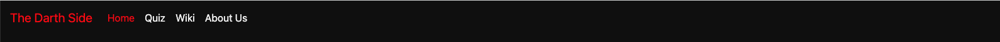
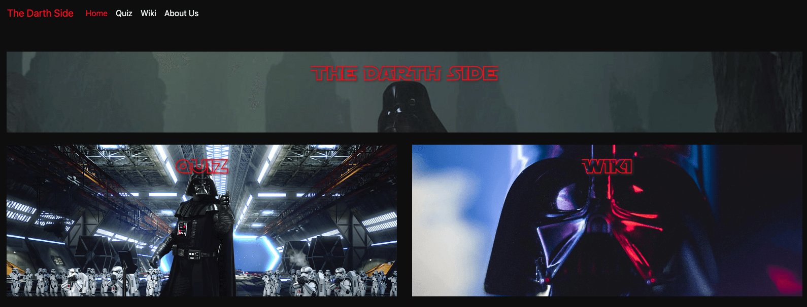
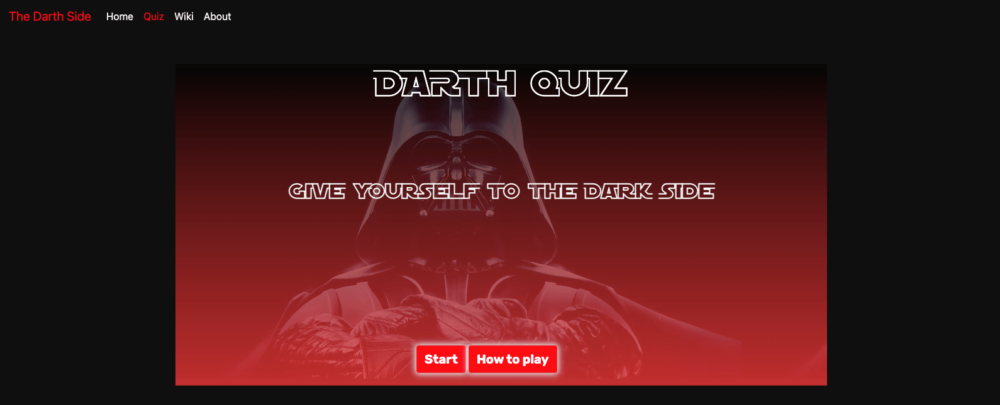
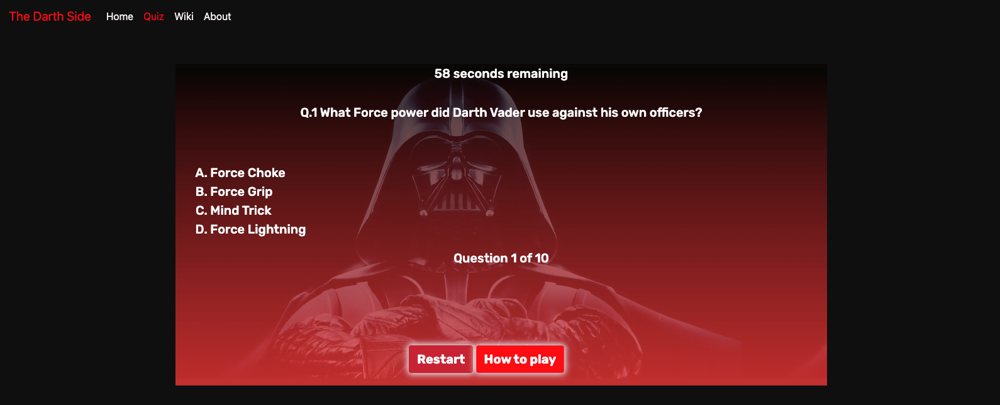
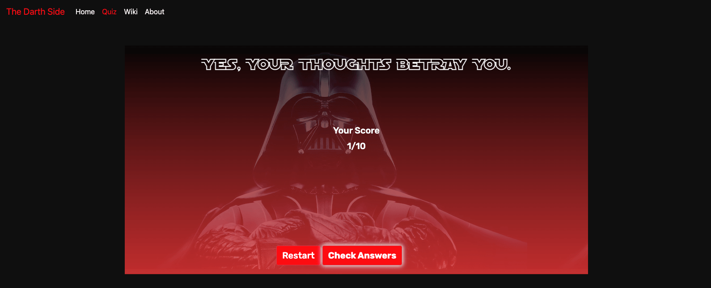
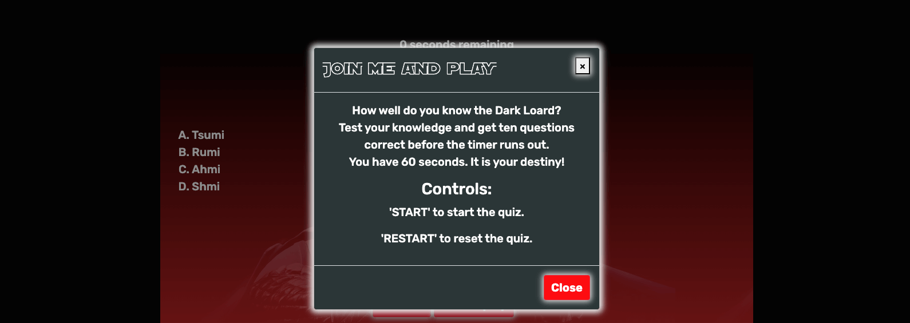
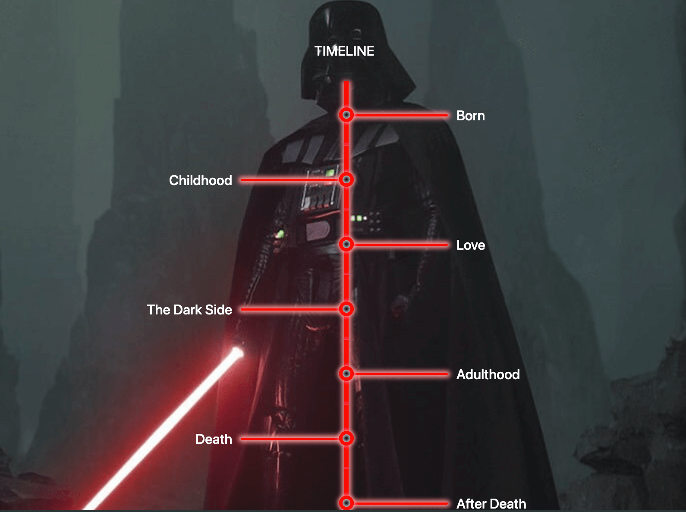
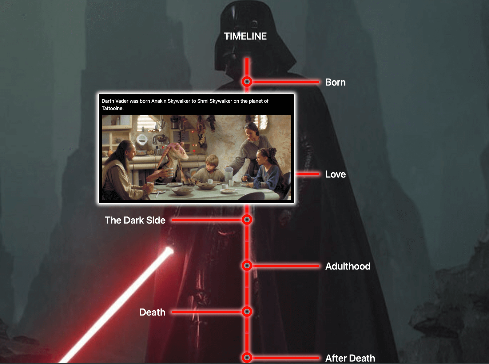

# The Darth Side - Testing

Visit the deployed site: [The Darth Side](https://desislavanaydenova.github.io/2405-hackathon-team1-StarWars/quiz.html)

- - -

## CONTENTS

* [AUTOMATED TESTING](#automated-testing)
  * [W3C Validator](#w3c-validator)
  * [JavaScript Validator](#javascript-validator)
* [MANUAL TESTING](#manual-testing)
  * [Testing User Stories](#testing-user-stories)
  * [Full Testing](#full-testing)

Testing was ongoing throughout the entire build. We utilised Chrome developer tools whilst building to pinpoint and troubleshoot any issues as we went along.

During development we made use of google developer tools to ensure everything was working correctly and to assist with troubleshooting when things were not working as expected.

We utilised the console in the developer tools to work through small sections of JavaScript and ensure that the code was working, and also to troubleshoot where issues were.

We have gone through each page using google chrome developer tools & Firefox inspector tool to ensure that each page is responsive on a variety of different screen sizes and devices.

- - -

## AUTOMATED TESTING

### W3C Validator

[W3C](https://validator.w3.org/) was used to validate the HTML on all pages of the website. It was also used to validate the CSS.

* [Home Page]()
* [Quiz]()
* [Wiki]()
* [About]()
* [404]()

* [style.css]()
* [about.css]()
* [wiki.css](docs/testing/validation/wiki-css-validation.png) - ✅
* [404.css](docs/testing/validation/404-css-validation.png) - ✅

- - -

### JavaScript Validator

[jshint](https://jshint.com/) was used to validate the JavaScript.

* [script.js]()
* [quiz.js]()
* [wiki.js]()

- - -

## MANUAL TESTING

### Testing User Stories

`Navigation`

| Goals | How are they achieved? | Evidence |
| :--- | :--- | :--- |
| I want to gain access to the gain access to the Home, About Us, Quiz and Wiki page via the nav bar so that I can understand what areas of the site to visit. | A Navbar with links to all pages of the site is utilised. |  |
| I want to able to visually identify what page I am on using the nav bar so that I can know what page I am on. | The current page is highlighted red in the navbar |  |

`Home Page`

|  Goals | How are they achieved? | Evidence |
| :--- | :--- | :--- |
| I want to be able to view a home page with an image of Darth Vader so that I can understand the theme of the website. | The home page has a banner with an image of Darth Vader. |  |
| I want to have clear options on what areas of the site I should visit so that I understand where the main features of the site are. | A navbar is available on each page, along with cards on the main page |  |
| I want to be able to view a home page with an image of Darth Vader so that I can understand the theme of the website. | The home page has a banner with an image of Darth Vader. |  |
| I want to have clear options on what areas of the site I should visit so that I understand where the main features of the site are. | A navbar is available on each page, along with cards on the main page |  |

`About Us`

| Goals | How are they achieved? | Evidence |
| :--- | :--- | :--- |
| I want to view a list of collaborators and their roles so that I can understand who was involved in building the site. | Bootstrap Cards have been utilised with information on each team member along with a Star Wars themed avatar and links to their Linkedin and GitHub profiles | |
| I want to view short summary of why the site was created so that I can gain an insight into the websites origin. | | |

`Quiz Page`

| Goals | How are they achieved? | Evidence |
| :--- | :--- | :--- |
| I want to be able to participate in a quiz about Darth Vader so that I can test my knowledge about this character. | A quiz is provided on the site with questions to test users knowledge of Darth Vader |  |
| I want to have multiple choice options so that I have I higher chance of selecting the correct answer. | Each quesion provides 4 possible answers for the user to select from |  |
| I want to receive a performance based nofication upon completion so that I can see how well I know Darth Vader. | At the end of the quiz, users are shown their score |  |
| I want to be able to refer to the instructions without having to restart the game so that I can have a quick reminder if I forget and continue to play. | The quiz page has a how to play button that displays at the beginning of the quiz before you start and also whilst playing. Clicking this will open a modal that displays how to play instructions. |  |
| I want to have Start and Restart buttons so I have some control over the flow of the game. | A Start button allows the user to choose when to start the quiz, and a restart button is provided during the quiz to allow the user to restart at any time |  |
| I want to have time limited questions so that the game doesn't take all day. | The quiz utilises a timer|  |
| I want to be able to participate in a quiz about Darth Vader so that I can test my knowledge about this character. | A quiz is provided on the site with questions to test users knowledge of Darth Vader |  |
| I want to have multiple choice options so that I have I higher chance of selecting the correct answer. | Each quesion provides 4 possible answers for the user to select from |  |
| I want to receive a performance based nofication upon completion so that I can see how well I know Darth Vader. | At the end of the quiz, users are shown their score |  |
| I want to be able to refer to the instructions without having to restart the game so that I can have a quick reminder if I forget and continue to play. | The quiz page has a how to play button that displays at the beginning of the quiz before you start and also whilst playing. Clicking this will open a modal that displays how to play instructions. |  |
| I want to have Start and Restart buttons so I have some control over the flow of the game. | A Start button allows the user to choose when to start the quiz, and a restart button is provided during the quiz to allow the user to restart at any time |  |
| I want to have time limited questions so that the game doesn't take all day. | The quiz utilises a timer|  |

`Wiki Page`

| Goals | How are they achieved? | Evidence |
| :--- | :--- | :--- |
| I want to be able to view a timeline of Darth Vaders life story so that I can learn about the character in a structured way. | Timeline of Darth Vaders Life for users to explore |  |
| I want to be able to read text that is relevant to each part of the timeline so that I can learn about specific area that interest me. | Users can select a period of the timeline and click to reveal more information |  |
| I want to be able to view a relevant image on each part of the timeline so that I can gain a visual understanding of what happend during this period. | Images are shown as part of the detailed information |  | 
| I want to be able to interact with each images on the timeline so that I can see the image in more detail. |||

`General`

| Goals | How are they achieved? |
| :--- | :--- |
| I want to be able to hear the lightsaber sound when I hover over key areas of the site so that I can feel like I am part of the Star Wars universe. | Sound effects have been added to the cards on the home page that will play when they are moused over.| Sound effects have been added in several places on the website, for example the home page cards. |
| Goals | How are they achieved? |
| :--- | :--- |
| I want to be able to hear the lightsaber sound when I hover over key areas of the site so that I can feel like I am part of the Star Wars universe. | Sound effects have been added to the cards on the home page that will play when they are moused over.| Sound effects have been added in several places on the website, for example the home page cards. |

- - -

### Full Testing

Full testing was performed on the following devices:

* Laptop:
  * Macbook Pro 2021 14 inch screen
  * Pacard 13.5 inch screen
  * acer Aspire 3 15 inch screen
  * HP Pavilion 15 inch screen
* Mobile Devices:
  * iPhone 13 pro
  * Google Pixel 6
  * Google Pixel 6 Pro
  * Galaxy A71 
  * Moto GP

Each device tested the site using the following browsers:

* Google Chrome
* Safari
* Firefox
* Opera 

Additional testing was taken by friends and family on a variety of devices and screen sizes. 

| Feature | Expected Outcome | Testing Performed | Result | Pass/Fail |
| --- | --- | --- | --- | --- |
| `Navbar` |
| --- | --- | --- | --- | --- |
| Site Name | When clicked, user will be taken to the home page | Clicked site name | Taken to home page | ✅ |
| Home Nav Item | When clicked, user will be taken to the home page | Clicked home nav item | Taken to the home page | ✅ |
| Quiz Nav Item | When clicked, user will be taken to the home page | Clicked quick nav item | Taken to the quiz page | ✅ |
| Wiki Nav Item | When clicked, user will be taken to the wiki page | Clicked wiki nav item | Taken to the wiki page | ✅ |
| About Nav Item | When clicked, user will be taken to the about page | Clicked about nav item | Taken to the about page | ✅ |
| Active on page | It is clear which page you are currently on, as the nav item will be red to hightlight the active page | Visit pages to see if they update to display as red in navbar | The current page is displayed as red in the navbar | ✅ |
| Hover effect on nav items | When user hovers over a nav item in the navbar, a red bar will be displayed underneath | Hovered over nav items in the navbar | When hovered over, the nav item displays a red bar underneath | ✅ |
| `Footer` |
| --- | --- | --- | --- | --- |
| GitHub icon | When clicked, user will be taken to the GitHub repo for this project in a new tab. | Clicked icon | Taken to the project GitHub page in a new tab | ✅ |
| Team icon | When clicked, user will be taken to the about page. | Clicked icon | Taken to about page | ✅ |
| Icon Hover | When user hovers over the icon, the icon changes color to red to indicate the user is hovered over the icon | Hover over icons | Icons change to red | ✅ |
| `Home Page` |
| --- | --- | --- | --- | --- |
| Quiz Card | When clicked, user is taken to the quiz page | Clicked quiz card | Taken to the quiz page | ✅ |
| Wiki Card | When clicked, user is taken to the wiki page | Clicked wiki card | Taken to the quiz page | ✅ |
| Sound Effect | When card on home page is moused over, a sound effect will play | Mouseover card | Sound effect plays | ✅ |
| `Quiz Page` |
| --- | --- | --- | --- | --- |
| `Wiki Page` |
| --- | --- | --- | --- | --- |
| `About Page` |
| --- | --- | --- | --- | --- |
| Team Member Linkedin Links| When clicked, user is taken to that members Linkedin Page in a new tab ||||
|Team Member GitHub Links | When clicked, user is taken to that members GitHub Profile Page in a new tab ||||